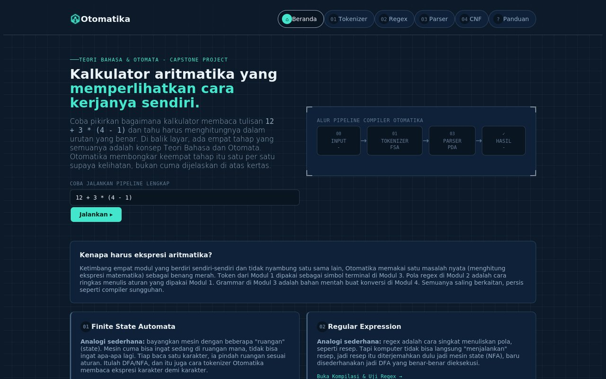
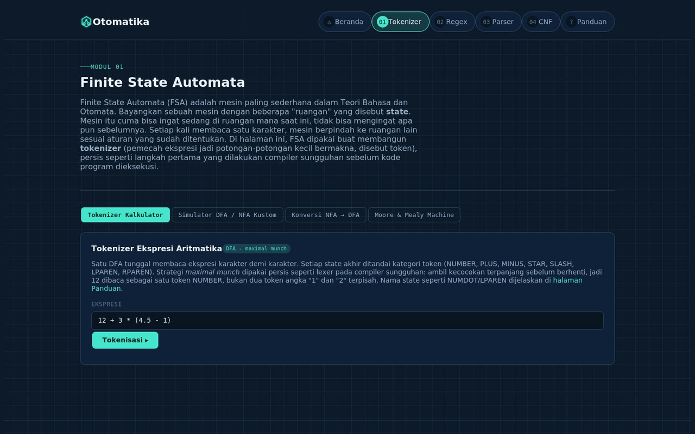
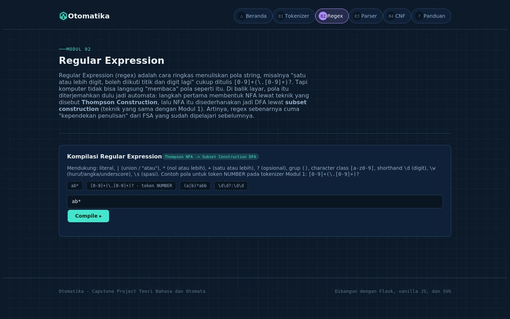
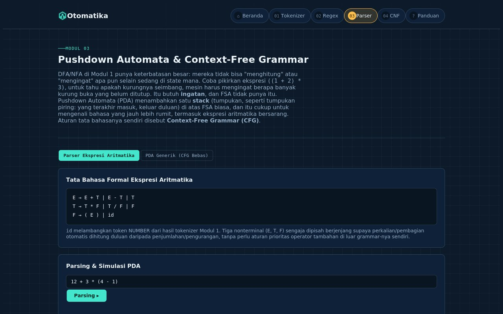
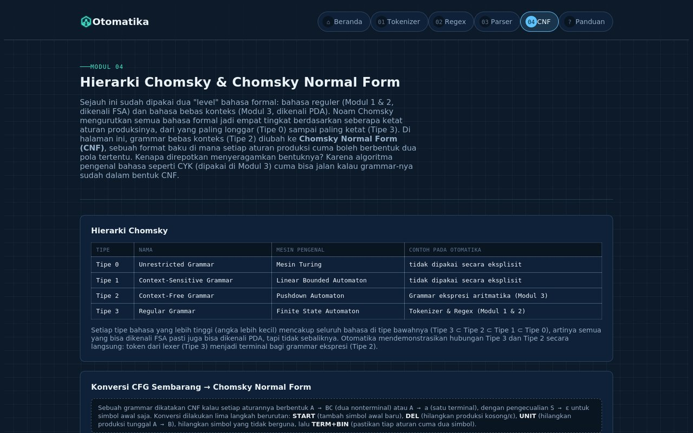

<div align="center">

# ⚙️ Otomatika

### Belajar Teori Bahasa dan Otomata Lewat Kalkulator Ekspresi Aritmatika

Satu masalah nyata, empat konsep TBO: **Finite State Automata**, **Regular Expression**,
**Pushdown Automata & Context-Free Grammar**, hingga **Chomsky Normal Form**, semuanya
divisualisasikan langsung di browser.

[](https://www.python.org/)
[](https://flask.palletsprojects.com/)
[](#menjalankan-test)
[](#tech-stack)

**[🌐 Live Demo](https://www.301240010.my.id/)** &nbsp;•&nbsp;
**[🎬 Video Demo](https://youtu.be/JAdCYYEzK94)** &nbsp;•&nbsp;
**[📦 Repository](https://github.com/Alnazh/tbo-capstone-301240010)**

</div>

---

## 📖 Daftar Isi

- [Tentang Proyek](#-tentang-proyek)
- [Tampilan Aplikasi](#-tampilan-aplikasi)
- [Daftar Fitur per Modul](#-daftar-fitur-per-modul)
- [Tech Stack](#-tech-stack)
- [Struktur Folder](#-struktur-folder)
- [Cara Instalasi Lokal](#-cara-instalasi-lokal)
- [Menjalankan Test](#-menjalankan-test)
- [Deployment](#-deployment)
- [Catatan Integritas Akademik](#-catatan-integritas-akademik)

---

## 📌 Tentang Proyek

Otomatika adalah aplikasi web yang membedah satu masalah yang sangat familiar bagi
mahasiswa, yaitu menghitung ekspresi aritmatika, lalu membongkarnya jadi empat tahapan
sesuai kurikulum Teori Bahasa dan Otomata. Alih-alih menjelaskan FSA, regex, PDA, dan CNF
secara terpisah dan abstrak, aplikasi ini menunjukkan bagaimana keempatnya benar-benar
bekerja sama membentuk satu pipeline nyata, mulai dari string mentah `"3 + 4 * (2 - 1)"`
sampai menjadi hasil akhir yang dihitung.

Setiap algoritma inti (mesin FSA, regex engine, parser, CYK, konversi CNF/GNF) ditulis
manual tanpa mengandalkan modul `re` bawaan Python. Tujuannya supaya proses belajar
benar-benar terjadi di level implementasi, bukan sekadar memanggil library pihak ketiga.

Proyek ini dibangun untuk memenuhi Capstone Project mata kuliah Teori Bahasa dan Otomata,
Semester IV, Tahun Akademik 2025/2026 Genap.

## 🖼️ Tampilan Aplikasi

<table>
<tr>
<td width="50%">

**Beranda**
Pipeline demo dan kartu navigasi menuju keempat modul.



</td>
<td width="50%">

**Modul 1: Tokenizer (FSA)**
Visualisasi diagram state dan jejak transisi per token.



</td>
</tr>
<tr>
<td width="50%">

**Modul 2: Regular Expression**
Compiler regex buatan sendiri lengkap dengan jejak pencocokan state.



</td>
<td width="50%">

**Modul 3: Parser & PDA**
Pohon penurunan, derivasi kiri kanan, dan simulasi stack PDA.



</td>
</tr>
<tr>
<td colspan="2">

**Modul 4: Hierarki Chomsky & CNF**
Konversi CFG ke Chomsky Normal Form langkah demi langkah, lengkap dengan panel edukatif hierarki Chomsky.



</td>
</tr>
</table>

## 🧩 Daftar Fitur per Modul

### Modul 1: Finite State Automata
- Tokenizer ekspresi aritmatika berbasis satu DFA (strategi *maximal munch*), lengkap dengan visualisasi diagram state dan jejak transisi per token lewat stepper animasi.
- Simulator DFA/NFA kustom, mesin bisa didefinisikan sendiri lewat format teks, string apa pun bisa diuji, dan tipe mesin (DFA/NFA) terdeteksi otomatis.
- Konversi NFA ke DFA (subset construction) lengkap dengan tabel langkah dan diagram sebelum sesudah, termasuk contoh NFA dengan transisi epsilon.
- **Bonus:** simulator Moore Machine dan Mealy Machine.

### Modul 2: Regular Expression
- Mesin regex buatan sendiri, bukan modul `re` bawaan Python, dengan alur parser menuju Thompson Construction (NFA) lalu Subset Construction (DFA).
- Mendukung union `|`, `*`, `+`, `?`, grup `()`, character class `[a-z0-9]`, dan shorthand `\d \w \s`.
- Menampilkan tata bahasa reguler (linear kanan) yang ekuivalen dengan DFA hasil kompilasi.
- Uji pencocokan string dengan visualisasi jejak state per karakter.

### Modul 3: Pushdown Automata & CFG
- Parser ekspresi aritmatika dengan grammar `E/T/F` standar memakai teknik *precedence climbing*, menghasilkan pohon penurunan, derivasi kiri dan kanan, sekaligus simulasi stack PDA (shift-reduce) langkah demi langkah.
- **PDA generik:** menerima CFG bebas yang didefinisikan pengguna, otomatis dikonversi ke CNF lalu diuji keanggotaannya dengan algoritma CYK. Jika diterima, pohon penurunan dan jejak stack direkonstruksi dari hasil CYK.

### Modul 4: Hierarki Chomsky & CNF
- Panel edukatif hierarki Chomsky (Tipe 0 sampai 3) dan kaitannya dengan tiap modul di atas.
- Konversi CFG sembarang menuju Chomsky Normal Form, menampilkan setiap langkah transformasi (START, eliminasi epsilon/nullable, eliminasi unit production, eliminasi simbol useless, TERM dan BIN).
- **Bonus:** konversi ke Greibach Normal Form. Sifatnya masih eksperimental untuk grammar yang sangat kompleks, dan aplikasi akan memberi pesan jujur jika gagal, bukan hasil yang salah.

## 🛠️ Tech Stack

| Bagian | Teknologi |
|---|---|
| Backend | Python 3, Flask |
| Frontend | HTML5, CSS3 custom, JavaScript vanilla tanpa framework, grid dan utilitas CSS buatan sendiri tanpa CDN eksternal |
| Visualisasi | SVG digambar dinamis di sisi klien untuk diagram automata, pohon penurunan, dan tabel CYK, tanpa library diagram eksternal |
| Pengujian | `unittest` dengan 41 test backend di `tests/test_app.py`, ditambah regresi logika frontend murni lewat Node `vm` di `tests_js/run.js` |
| Deployment | Gunicorn, custom domain `.my.id` dengan HTTPS |

Seluruh algoritma inti, mulai dari automata, regex engine, CYK, sampai konversi CNF/GNF,
ditulis manual tanpa memakai modul `re` bawaan Python. Ini untuk benar-benar
mendemonstrasikan konsep otomata dari mata kuliah, bukan menyerahkannya ke library pihak
ketiga.

## 📂 Struktur Folder

```
otomatika/
├── app.py                 # seluruh logika Python & routing Flask
├── templates/
│   ├── base.html          # layout bersama (navbar, footer) dipakai semua halaman
│   ├── home.html          # beranda: pipeline demo + kartu navigasi ke 4 modul
│   ├── tokenizer.html     # halaman Modul 1: tokenizer & simulator FSA
│   ├── regex.html         # halaman Modul 2: regular expression
│   ├── parser.html        # halaman Modul 3: parser aritmatika & PDA generik
│   └── cnf.html           # halaman Modul 4: hierarki Chomsky & konversi CNF/GNF
├── static/
│   ├── grid.css            # grid & utilitas layout sendiri (tanpa CDN Bootstrap)
│   ├── style.css          # seluruh gaya CSS
│   └── script.js          # seluruh logika JavaScript sisi klien
├── tests/
│   └── test_app.py        # 41 test case backend
├── tests_js/
│   └── run.js              # test regresi logika frontend murni (Node vm)
├── docs/
│   ├── PROPOSAL.md
│   ├── AI_USAGE_DISCLOSURE.md
│   └── screenshots/        # gambar tangkapan layar yang dipakai README ini
├── requirements.txt
├── Procfile                # untuk deploy ke Railway/Render/Heroku-like platform
└── README.md
```

`app.py` dibagi menjadi 5 bagian bertanda komentar (`# BAGIAN 1` sampai `# BAGIAN 5`)
mengikuti urutan modul, ditutup bagian `# ROUTES FLASK` untuk endpoint. Semua logika
sengaja disatukan dalam satu file supaya mudah diserahkan sebagai satu kesatuan, tapi
tetap tersusun rapi per bagian.

## 💻 Cara Instalasi Lokal

```bash
git clone https://github.com/Alnazh/tbo-capstone-301240010.git
cd tbo-capstone-301240010

python3 -m venv venv
source venv/bin/activate        # Windows: venv\Scripts\activate

pip install -r requirements.txt
python app.py
```

Aplikasi akan berjalan di `http://127.0.0.1:5000`.

## ✅ Menjalankan Test

```bash
python -m unittest tests.test_app -v   # 41 test backend (Python)
node tests_js/run.js                   # test regresi logika frontend (JS)
```

## 🚀 Deployment

Aplikasi ini sudah live dan bisa diakses langsung di **[www.301240010.my.id](https://www.301240010.my.id/)**.
Karena backend-nya Flask, deployment memakai server proses Python asli lewat Gunicorn,
bukan static hosting seperti GitHub Pages. Domain `.my.id` diarahkan ke platform hosting
lalu diamankan dengan HTTPS.

Demo penggunaan aplikasi secara menyeluruh, termasuk penjelasan konsep di balik tiap
modul, ada di video berikut: **[Video Demo di YouTube](https://youtu.be/JAdCYYEzK94)**.

## 🎓 Catatan Integritas Akademik

Tugas ini bersifat individu. Lihat `docs/AI_USAGE_DISCLOSURE_TEMPLATE.md` untuk lampiran
terkait penggunaan AI generatif dalam pengerjaan proyek ini.

---

<div align="center">

Dibuat sebagai Capstone Project mata kuliah Teori Bahasa dan Otomata, Semester IV

</div>
